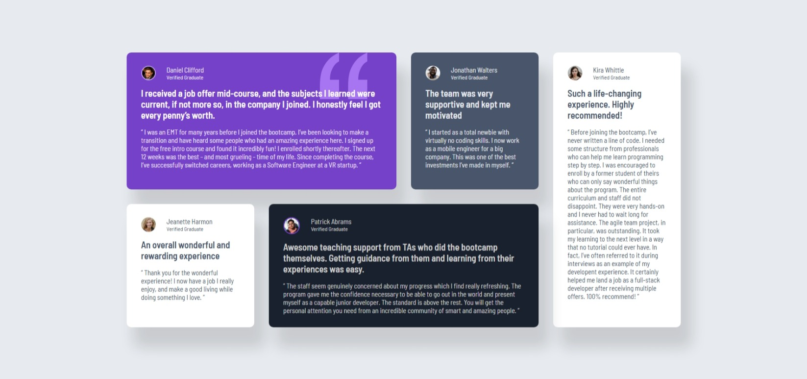

# Frontend Mentor - Testimonials grid section solution

This is a solution to the [Testimonials grid section challenge on Frontend Mentor](https://www.frontendmentor.io/challenges/testimonials-grid-section-Nnw6J7Un7). Frontend Mentor challenges help you improve your coding skills by building realistic projects. 

## Table of contents

- [Overview](#overview)
  - [The challenge](#the-challenge)
  - [Screenshot](#screenshot)
  - [Links](#links)
- [My process](#my-process)
  - [Built with](#built-with)
  - [Useful resources](#useful-resources)
- [Author](#author)

## Overview

### The challenge

Users should be able to:

- View the optimal layout for the site depending on their device's screen size

### Screenshot

### Links

- Solution URL: [Solution URL](https://github.com/MaluWhoo/Testimonials-grid-section-solution)
- Live Site URL: [Site URL](https://maluwhoo.github.io/Testimonials-grid-section-solution/)

## My process

### Built with

- Semantic HTML5 markup
- CSS custom properties
- Flexbox
- CSS Grid
- Mobile-first workflow

### Useful resources

- [Bento Grids](https://youtu.be/v0o1kV-qfVI?si=3MudKZ5V6Sc1Wv8s) - This helped with Grid Bento. 

## Author

- Website - [Malu's GitHub](https://github.com/MaluWhoo)
- Frontend Mentor - [@MaluWhoo](https://www.frontendmentor.io/profile/MaluWhoo)
